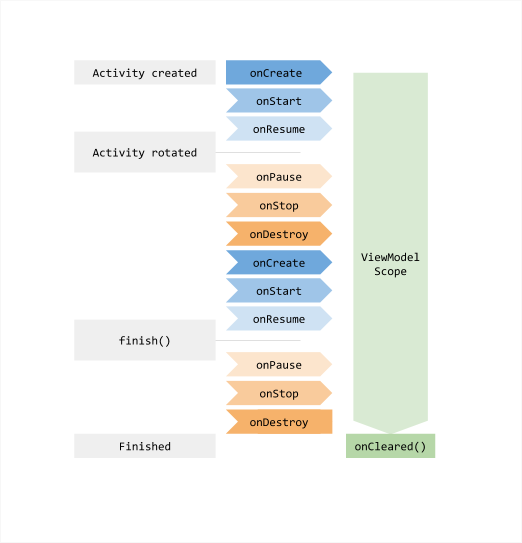

# Android Lifecycle-aware Components Codelab

Please follow along the codelab steps [here](https://codelabs.developers.google.com/codelabs/android-lifecycles/).

# Filing issues

If you find errors in the codelab steps or the code, please file them [here](https://github.com/googlecodelabs/android-lifecycles/issues/new)

## 학습 목록

## 학습 Review

1. ViewModel 정의 및 특징 (feat. Android Developer Site)
```
ViewModel is a class that is responsible for preparing and managing the data for an Activity or a Fragment. It also handles the communication of the Activity / Fragment with the rest of the application (e.g. calling the business logic classes).

A ViewModel is always created in association with a scope (an fragment or an activity) and will be retained as long as the scope is alive. E.g. if it is an Activity, until it is finished.

In other words, this means that a ViewModel will not be destroyed if its owner is destroyed for a configuration change (e.g. rotation). The new instance of the owner will just re-connected to the existing ViewModel.

The purpose of the ViewModel is to acquire and keep the information that is necessary for an Activity or a Fragment. The Activity or the Fragment should be able to observe changes in the ViewModel. ViewModels usually expose this information via LiveData or Android Data Binding. You can also use any observability construct from you favorite framework.

ViewModel's only responsibility is to manage the data for the UI. It should never access your view hierarchy or hold a reference back to the Activity or the Fragment.
```

```
You can use a ViewModel to retain data across the entire lifecycle of an activity or a fragment. As the previous step demonstrates, an activity is a poor choice to manage app data. Activities and fragments are short-lived objects which are created and destroyed frequently as a user interacts with an app. A ViewModel is also better suited to managing tasks related to network communication, as well as data manipulation and persistence.
```

2. 

